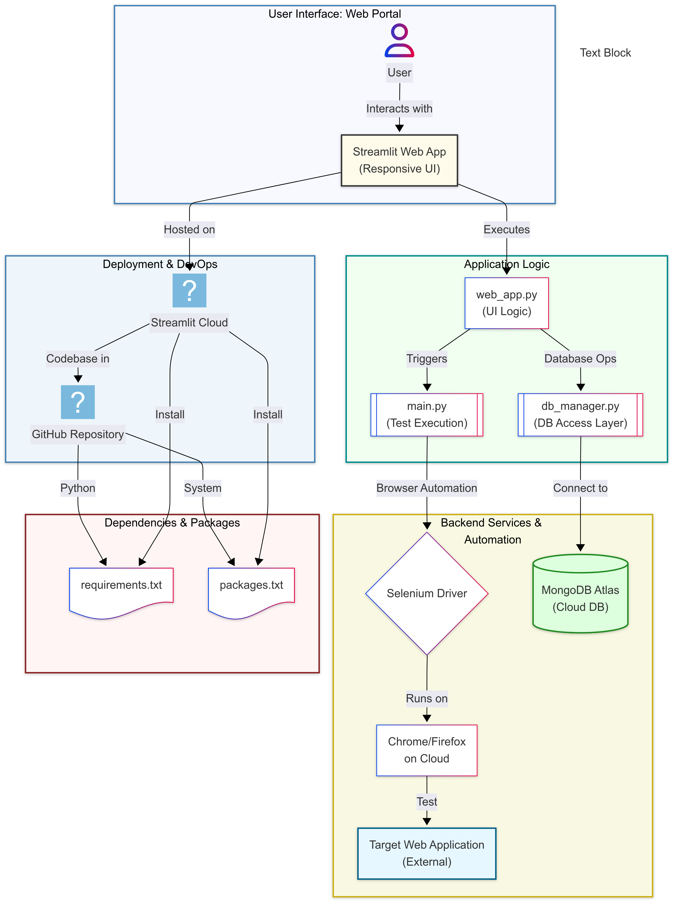

# Testing Portal

[](https://testinga.streamlit.app/)

A comprehensive, cloud-native platform for web automation testing, built with Streamlit and Selenium. This portal allows you to upload, create, and execute Selenium IDE (`.side`) test files directly from a web interface, with results and screenshots saved to a MongoDB database.

## 📸 Screenshots

| Dashboard | Test Editor |
|-----------|-------------|
|  |  |

| Execution Results | Screenshot Viewer |
|-------------------|-------------------|
|  |  |

---
---

## 🎨 System Design

The entire platform is designed for scalability and maintainability, running serverlessly on Streamlit Cloud.



---

## 🌟 Features

*   **Cloud-Native**: Deployable on Streamlit Cloud with zero server management.
*   **SIDE File Execution**: Upload and run Selenium IDE `.side` files directly.
*   **Manual Test Editor**: Create and edit test cases and steps from the UI.
*   **Database Integration**: All test runs, results, and screenshots are saved to MongoDB Atlas.
*   **Screenshot Viewer**: View all captured screenshots directly in the history tab.
*   **URL Monitoring**: Ping application URLs to check their status and latency.
*   **Dynamic Parameterization**: Map global or run-specific parameters to your tests.
*   **Clean, Responsive UI**: Built with Streamlit for a great user experience on any device.

---

## 🛠️ Tech Stack

*   **Frontend**: Streamlit
*   **Backend & Automation**: Python, Selenium
*   **Database**: MongoDB Atlas
*   **Deployment**: Streamlit Cloud, GitHub

---

## 💻 Local Installation

To run the Testing Portal on your local machine, follow these steps:

**Prerequisites:**
*   Python 3.9+
*   Google Chrome or Firefox installed
*   MongoDB Atlas account (or a local MongoDB instance)

**1. Clone the Repository:**
```bash
git clone https://github.com/Tusharvoid/Testing-Portal.git
cd Testing-Portal
```

**2. Create a Virtual Environment:**
```bash
python -m venv venv
source venv/bin/activate  # On Windows, use `venv\Scripts\activate`
```

**3. Install Dependencies:**
The project uses two files for dependencies: `requirements.txt` for Python packages and `packages.txt` for system-level packages (used by Streamlit Cloud). For local setup, you only need to install the Python packages.
```bash
pip install -r requirements.txt
```

**4. Configure Secrets:**
Create a secrets file for your database connection string.
```bash
# Create the directory if it doesn't exist
mkdir -p .streamlit

# Create the secrets file and add your MongoDB URI
echo '[mongo]\nuri = "your_mongodb_atlas_connection_string"' > .streamlit/secrets.toml
```
Replace `"your_mongodb_atlas_connection_string"` with your actual MongoDB connection string.

**5. Run the Application:**
```bash
streamlit run web_app.py
```
The application should now be running on `http://localhost:8501`.

---

## ☁️ Streamlit Cloud Deployment

This repository is optimized for one-click deployment on Streamlit Cloud.

1.  **Fork this repository** to your GitHub account.
2.  Go to [share.streamlit.io](https://share.streamlit.io/) and click "**New app**".
3.  Select the forked repository and the `main` branch.
4.  In the "**Advanced settings**" section, go to the "**Secrets**" tab and add your MongoDB connection string:
    ```toml
    [mongo]
    uri = "your_mongodb_atlas_connection_string"
    ```
5.  Click "**Deploy!**". Streamlit Cloud will automatically install all Python and system dependencies from `requirements.txt` and `packages.txt`.

---

## 📂 Project Structure

The repository is organized with a clean structure for easy maintenance and deployment.

```
Testing-Portal/
├── .streamlit/
│   ├── config.toml        # Streamlit configuration
│   └── secrets.toml       # Local secrets (ignored by git)
├── web_app.py             # Main Streamlit application UI
├── main.py                # Selenium test execution engine
├── db_manager.py          # Database operations (MongoDB)
├── streamlit_packages.py  # Cloud package installer helper
├── requirements.txt       # Python dependencies
├── packages.txt           # System-level dependencies for Streamlit Cloud
├── .gitignore             # Git ignore rules
└── README.md              # This file
```
